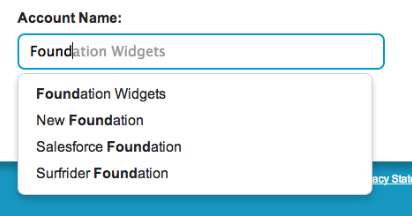

visualforce-typeahead
=====================

A flexible typeahead component for use on Visualforce pages.  Uses the typeahead.js library from Twitter.

Use this component to provide a lookup field for related objects, such as the account for a contact.

###Installation
Click here to install: 
https://githubsfdeploy.herokuapp.com/?owner=SalesforceFoundation&repo=visualforce-typeahead

###Video Intro
A 4-minute video showing the basic functionality:  http://youtu.be/Cc87v39Z9tY

###Usage
If you include the component on a Visualforce page in its simplest form, it will search Contacts:
	
	<c:Typeahead />

There are many attributes you can pass to the component to change its behavior.  For example, the following searches Accounts and puts the ID it finds into a hidden field you can access in your controller.

	<h3>Account Name:</h3>
	<c:Typeahead object="Account" destinationForSelectedId="accountId" />	
	<apex:hidden id="accountId" value="{!accountId}" />		

For simple examples, see the TypeaheadTest page. To view all available attributes, see the Typeahead component.

Note: The component depends on jQuery, which it loads automatically if your page doesn't already include it. However, if your page does load jQuery, it must be version 1.9+ to be compatible.

###Possible Improvements
* pass in a function to call when something is selected (so they don't have to click a button)
* specify where to put errors (and then use an alert if not specified)
* specify when to show secondary field (all the time or only when needed to make name unique)
* attribute to pass in HTML suggestion template, or function to render the template
* list of extra fields to query (especially if needed for suggestion template)
* option to use SOQL instead of SOSL - less flexible but faster and possibly more reliable

Contributors to the project are welcome.
